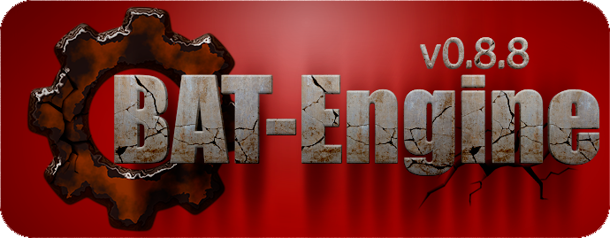



Администрирование
-----------------
1) [Workflow](adm/000-workflow.md)  
2) [Как создавать задачи?](adm/001-tasks.md)  
3) [Версионированние](adm/002-version.md)  

Разработка
----------
1) [Управляющие переменные](dev/000-variables.md)  
3) [Cоглашение о стилях](dev/001-notation.md)  
3) [Командная строка (Синопсис)](dev/002-cmd-sinopsis.md)  
4) [Командная строка (Строение)](dev/003-cmd-implement.md)  
5) [Командная строка (Аттрибуты)](dev/004-cmd-attrib.md)  
6) [Архитектура движка](dev/008-architecture.md)  
7) [Тестирование](test/000-tests.md)  

История
-------
1) [История](history.md)  

